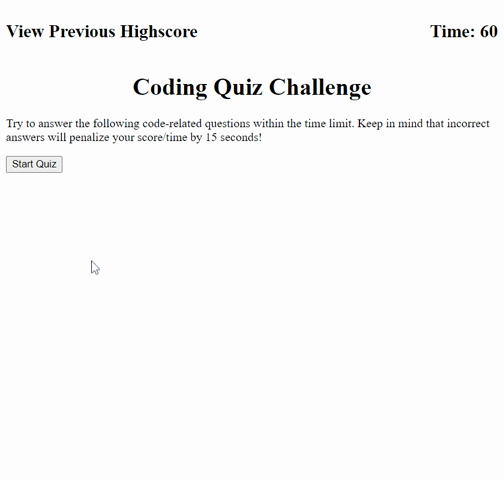

# Code Quiz

## Description

This application is a Code Quiz, allowing a user to test their knowledge of fundamental JavaScript topics. The quiz stores a user's previous score so they can track their progress as they retain more and more of the content. 

I was motivated to create this application because repetition is a great way to increase familiarity with a new topic and the best thing for a student to do when it comes to studying is to actively practice. This quiz provides students with an interactive way to review the topics they are learning in their coding boot camp, and in my opinion, dynamic and responsive learning tools yield the best results with students. 

Through working on this project, I have learned a lot about utilizing the great tools embedded in Web APIs to make dynamic, responsive webpages based on user interaction. Some of the biggest points of learning include:

* The Document Object Model and using querySelectors to access specific parts of my HTML file
* Creating EventListeners to trigger functions on clicks, submits, changes, etc. 
* Using createElement and appendChild to add new HTML elements to the page
* Utilizing setAttribute, style, and textContent to edit the qualities and verbiage of HTML elements
* Creating setIntervals to create adaptive functions in real time
* Events and Targets
* Leveraging the localStorage to retain user data to be called again at a later time

## Installation

N/A

## Usage

This timed quiz poses multiple-choice questions to a user and evaluates their selected answers in real time by displaying whether their selected response was correct or incorrect. If the user answers a question incorrectly, they are penalized by removing 15 seconds from the timer. When the a question is answered, a new question appears. There are 4 questions in total. After completing the 4 questions, the user is prompted to enter their initials into a text input box. When they hit the enter key on their keyboard, their initials are displayed next to their score, which is defined by how many seconds were left on the timer when they completed the quiz. Upon refresh, a user can view the score of the previous person to complete the quiz by clicking on "View Previous Highscore".

Link to deployed application:

    https://michael-loeffler.github.io/Code-Quiz/

## Credits

Mozilla Developer Network

## License

MIT License

Copyright (c) [2022] [Michael Loeffler]

Permission is hereby granted, free of charge, to any person obtaining a copy
of this software and associated documentation files (the "Software"), to deal
in the Software without restriction, including without limitation the rights
to use, copy, modify, merge, publish, distribute, sublicense, and/or sell
copies of the Software, and to permit persons to whom the Software is
furnished to do so, subject to the following conditions:

The above copyright notice and this permission notice shall be included in all
copies or substantial portions of the Software.

THE SOFTWARE IS PROVIDED "AS IS", WITHOUT WARRANTY OF ANY KIND, EXPRESS OR
IMPLIED, INCLUDING BUT NOT LIMITED TO THE WARRANTIES OF MERCHANTABILITY,
FITNESS FOR A PARTICULAR PURPOSE AND NONINFRINGEMENT. IN NO EVENT SHALL THE
AUTHORS OR COPYRIGHT HOLDERS BE LIABLE FOR ANY CLAIM, DAMAGES OR OTHER
LIABILITY, WHETHER IN AN ACTION OF CONTRACT, TORT OR OTHERWISE, ARISING FROM,
OUT OF OR IN CONNECTION WITH THE SOFTWARE OR THE USE OR OTHER DEALINGS IN THE
SOFTWARE.

---